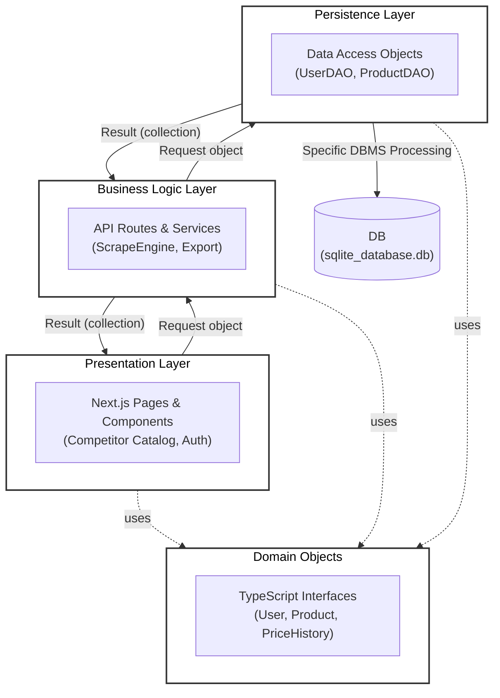

```mermaid
flowchart TD
    %% The Three Main Layers
    subgraph Presentation["Presentation Layer"]
        UI["Next.js Pages & Components
(Competitor Catalog, Auth)"]
    end

    subgraph BusinessLogic["Business Logic Layer"]
        API["API Routes & Services
(ScrapeEngine, Export)"]
    end

    subgraph Persistence["Persistence Layer"]
        DAO["Data Access Objects
(UserDAO, ProductDAO)"]
    end

    %% The Database
    DB[("DB\n(sqlite_database.db)")]

    %% The Domain Objects
    subgraph Domain["Domain Objects"]
        Models["TypeScript Interfaces
(User, Product, PriceHistory)"]
    end

    %% Flows between the layers
    Presentation -->|"Request object"| BusinessLogic
    BusinessLogic -->|"Result (collection)"| Presentation

    BusinessLogic -->|"Request object"| Persistence
    Persistence -->|"Result (collection)"| BusinessLogic

    Persistence -->|"Specific DBMS Processing"| DB

    %% Relationships to Domain Objects
    Presentation -.->|"uses"| Domain
    BusinessLogic -.->|"uses"| Domain
    Persistence -.->|"uses"| Domain

    %% Clean styling
    classDef layerBox fill:#ffffff,stroke:#333,stroke-width:2px,color:#000;
    class Presentation,BusinessLogic,Persistence,Domain layerBox;
```
