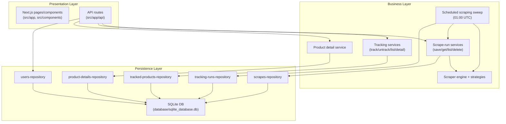
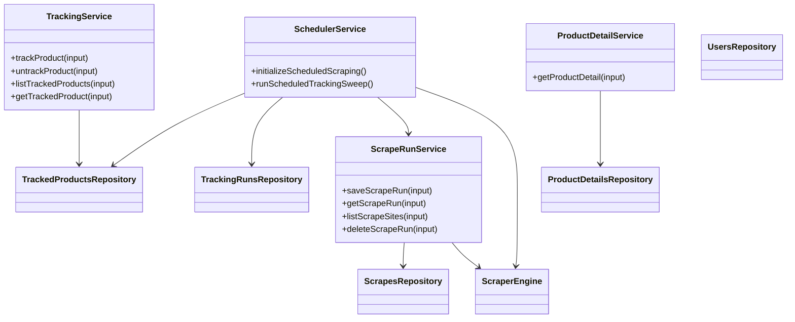

```mermaid
flowchart TD
    subgraph Presentation["Presentation Layer"]
        UI["Next.js pages/components\n(src/app, src/components)"]
        API["API routes\n(src/app/api)"]
    end

    subgraph Business["Business Layer"]
        ScrapeSvc["Scrape-run services\n(save/get/list/delete)"]
        TrackSvc["Tracking services\n(track/untrack/list/detail)"]
        ProductSvc["Product detail service"]
        Scheduler["Scheduled scraping sweep\n(01:00 UTC)"]
        Engine["Scraper engine + strategies"]
    end

    subgraph Persistence["Persistence Layer"]
        UserRepo["users-repository"]
        ScrapeRepo["scrapes-repository"]
        TrackRepo["tracked-products-repository"]
        TrackRunRepo["tracking-runs-repository"]
        ProductRepo["product-details-repository"]
        DB["SQLite DB\n(database/sqlite_database.db)"]
    end

    API --> ScrapeSvc
    API --> TrackSvc
    API --> ProductSvc

    ScrapeSvc --> Engine
    Scheduler --> Engine
    Scheduler --> ScrapeSvc
    Scheduler --> TrackRunRepo

    ScrapeSvc --> ScrapeRepo
    TrackSvc --> TrackRepo
    ProductSvc --> ProductRepo
    API --> UserRepo

    UserRepo --> DB
    ScrapeRepo --> DB
    TrackRepo --> DB
    TrackRunRepo --> DB
    ProductRepo --> DB
```

```mermaid
classDiagram
    class ScrapeRunService {
      +saveScrapeRun(input)
      +getScrapeRun(input)
      +listScrapeSites(input)
      +deleteScrapeRun(input)
    }

    class TrackingService {
      +trackProduct(input)
      +untrackProduct(input)
      +listTrackedProducts(input)
      +getTrackedProduct(input)
    }

    class SchedulerService {
      +initializeScheduledScraping()
      +runScheduledTrackingSweep()
    }

    class ProductDetailService {
      +getProductDetail(input)
    }

    class ScrapesRepository
    class TrackedProductsRepository
    class TrackingRunsRepository
    class ProductDetailsRepository
    class UsersRepository
    class ScraperEngine

    ScrapeRunService --> ScrapesRepository
    ScrapeRunService --> ScraperEngine

    TrackingService --> TrackedProductsRepository

    SchedulerService --> TrackedProductsRepository
    SchedulerService --> TrackingRunsRepository
    SchedulerService --> ScrapeRunService
    SchedulerService --> ScraperEngine

    ProductDetailService --> ProductDetailsRepository
```
